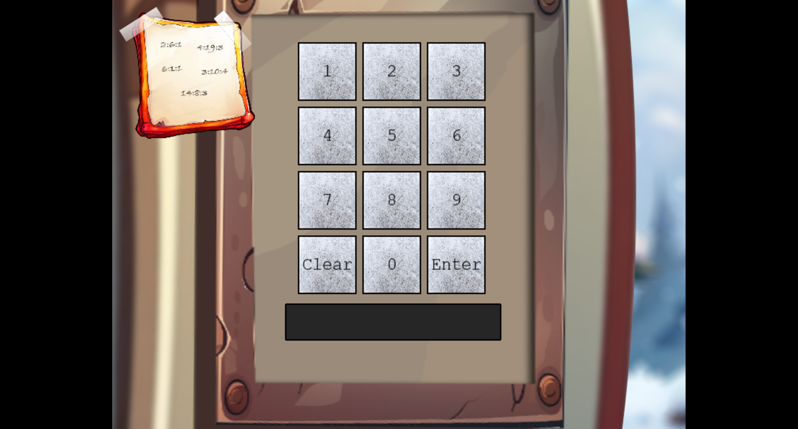
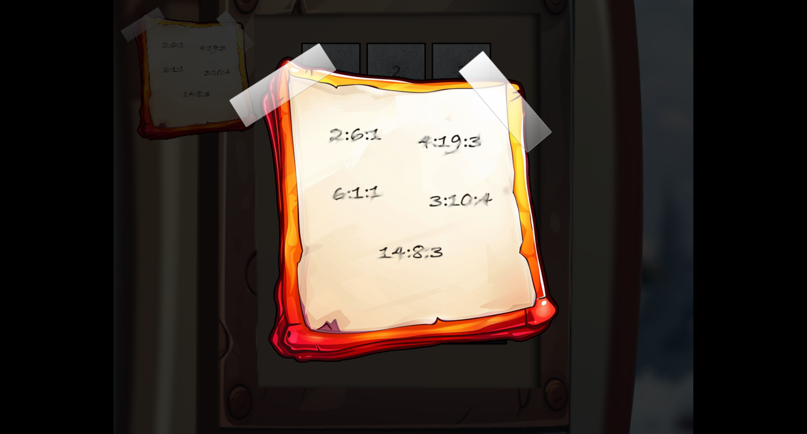
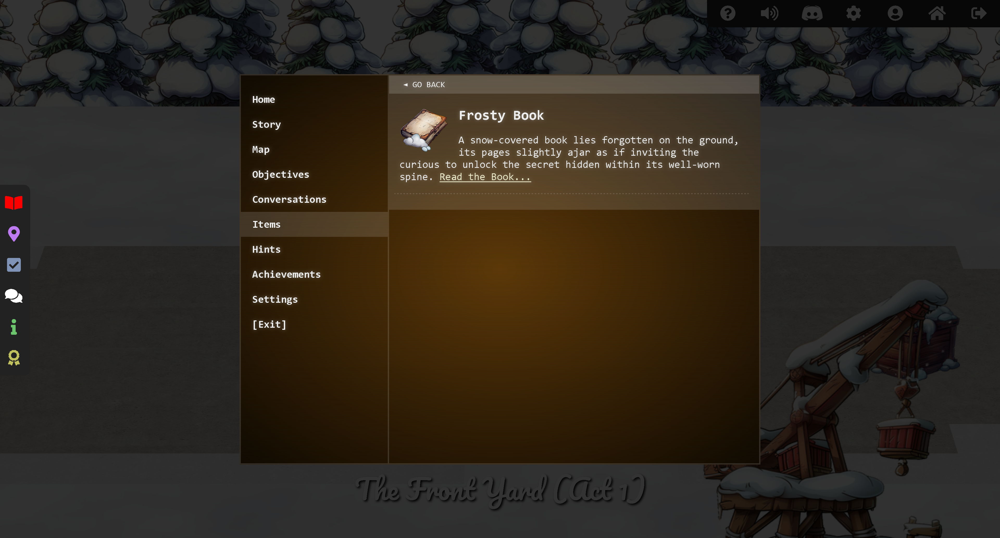

# Frosty Keypad

## Challenge Information
- **Difficulty**: 1 / 5
- **Description**: In a swirl of shredded paper, lies the key. Can you unlock the shredder’s code and uncover Santa's lost secrets?

## Table of Contents
0. [Challenge Information](#challenge-information)
1. [Dialog](#dialog)
2. [Solution: Silver](#solution-silver)
3. [Solution: Gold](#solution-gold)

## Dialog

Morcel Nougat:
```
> Hello again! I'm Morcel Nougat, dashing around like a reindeer on a sugar rush! We've got a bit of a dilemma, and I could really use your expertise.
> Wombley and Alabaster have taken charge now that Santa’s gone missing, and We're scrambling to get the Wish List secured. But... one of the elves in the Data Management Team got overzealous, and the Shredder McShreddin 9000 gobbled up a crucial document we need to access Santa's chest!
> It’s our golden ticket to getting Santa’s Little Helper tool working properly. Without it, the hardware hack we're planning is as empty as Santa’s sleigh in January.
> Think you can help? I can get you into the Shredder McShreddin 9000’s inner workings to retrieve the pieces, but there are two access codes involved. One of the elves left a hint, but it’s all a blur to me!
> I've noticed that some elves keep referring to a certain book when they walk by. I bet it has the answers we need to crack the code and recover the document!
> You know, some of the elves always have their noses in the same book when they pass by here. Maybe it’s got the clues we need to crack the code?
```

## Solution: Silver

When I open the machine, I am greeted by a keypad, as shown in the image below.



At the keypad, I see a note with what looks like hints for the code. It seems that the code is 5 digits long, so it should be possible to brute force it. However, I decide not to brute force the code because I remember that Morcel Nougat mentioned something about a book that the elves use to remember things.



I look around the area near Morcel Nougat and find a book on the ground next to one of the boxes.



The book refers to an external page where it can be read. You can read the book [here](https://frost-y-book.com/).

I try a few things and figure out that the hints from the note by the keypad follow the pattern: page:word:character, which corresponds to the following:

Sequence | Letter from book
--- | ---
2:6:1 | S
4:19:3 | A
6:1:1 | N
3:10:4 | T
14:8:3 | A

The hints match the word "SANTA," so I test the code 72682, as if typing it on an older mobile phone, and it works. Silver is unlocked.

## Solution: Gold

Based on the information from the silver solution, I think the code is five characters long and should be possible to brute-force.

I then check how the validation is done and discover that a POST request is made to:

`https://hhc24-frostykeypad.holidayhackchallenge.com/submit`

And with the POST request, a JSON body is sent as follows:

```json
{
    "answer": "72682"
}
```

At the same time as the silver solution was unlocked, Morcel Nougat mentioned something about a UV light that makes it possible to see which numbers have been pressed. I find a UV light behind one of the boxes in the area near Morcel Nougat.

By using the UV light on the keypad, I discover that only the numbers 2, 6, 7, and 8 are used.

Based on this information, I create the following Python script to check all combinations:

```python
import requests
import itertools
import time

url: str = "https://hhc24-frostykeypad.holidayhackchallenge.com/submit"

pins: list[int] = ["".join(n) for n in itertools.product("2678", repeat=5)]
for pin in pins:
    res = requests.post(url=url, json={"answer": pin})

    if res.status_code == 400:
        time.sleep(1)
        continue

    print(res.json(), pin)
```

After some time, I find the code `22786`, which I use on the keypad, and gold is unlocked.