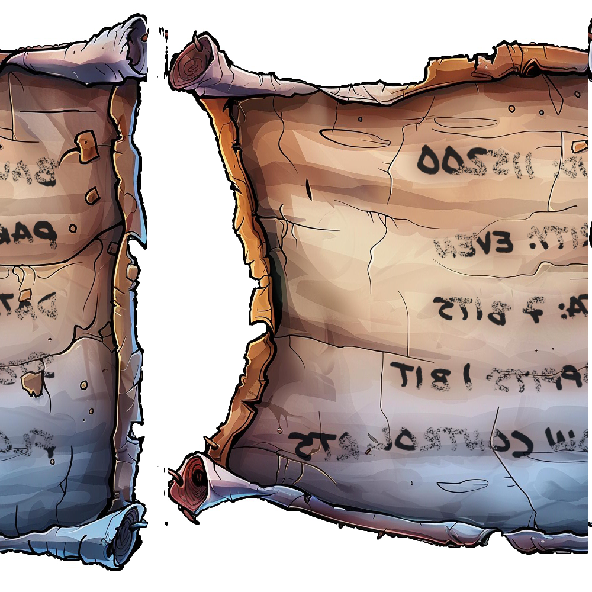

# Hardware Hacking 101

## Challenge Information
- **Difficulty**: 1 / 5
- **Description**: Ready your tools and sharpen your wits—only the cleverest can untangle the wires and unlock Santa’s hidden secrets!

## Table of Contents
0. [Challenge Information](#challenge-information)
1. [Hardware Hacking 101 Part 1](#hardware-hacking-101-part-1)
    - [Subchallenge Information](#subchallenge-information)
    - [Dialog](#dialog)
    - [Solution: Silver](#solution-silver)
    - [Solution: Gold](#solution-gold)
2. [Hardware Hacking 101 Part 2](#hardware-hacking-101-part-2)
    - [Subchallenge Information](#subchallenge-information-1)
    - [Dialog](#dialog-1)
    - [Solution: Silver](#solution-silver-1)
    - [Solution: Gold](#solution-gold-1)

## Hardware Hacking 101 Part 1

## Subchallenge Information
- **Difficulty**: 1 / 5
- **Description**: Jingle all the wires and connect to Santa's Little Helper to reveal the merry secrets locked in his chest!

## Dialog
Jewel Loggins:
```
> Hello there! I’m Jewel Loggins.
> I hate to trouble you, but I really need some help. Santa’s Little Helper tool isn’t working, and normally, Santa takes care of this… but with him missing, it’s all on me.
> I need to connect to the UART interface to get things running, but it’s like the device just refuses to respond every time I try.
> I've got all the right tools, but I must be overlooking something important. I've seen a few elves with similar setups, but everyone’s so busy preparing for Santa’s absence.
> If you could guide me through the connection process, I’d be beyond grateful. It’s critical because this interface controls access to our North Pole access cards!
> We used to have a note with the serial settings, but apparently, one of Wombley’s elves shredded it! You might want to check with Morcel Nougat—he might have a way to recover it.
```

## Solution: Silver

I open the challenge and am greeted by a manual.


I close the manual and am presented with various boards.


I play around with the UART and quickly encounter input fields for a series of settings.


I remember that Jewel Loggins mentioned Morcel Nougat might be able to help recreate these values.

I talk to Morcel Nougat, and he gives me `One Thousand Little Teeny Tiny Shredded Pieces of Paper` along with a hint containing a link to a Python script called `heuristic_edge_detection.py`.

> Note: To obtain these files, [ACT I: Frosty Keypad](../Frosty%20Keypad/README.md) must be solved first!


Files:
- [One Thousand Little Teeny Tiny Shredded Pieces of Paper](files/shreds.zip)
- [heuristic_edge_detection.py](files/heuristic_edge_detection.py)

I start by examining the ZIP file and find that it contains 1,000 JPG files. I check a few of them and notice that they are shredded, similar to the one shown below.


My immediate thought is that I need to piece together all the images into one large image to extract the values needed.

I take a look at the Python script, and it appears to assemble all the strips into a complete image.

In the main function, I notice a variable called `input_folder`, which matches the folder from the ZIP file. I unzip the ZIP file into the same directory as the script and run the script without making any changes.

```python
def main():
    input_folder = './slices'
    output_path = './assembled_image.png'

    slices = load_images(input_folder)
    matched_slices = find_best_match(slices)
    save_image(matched_slices, output_path)
```

After a short moment, I get the file `assembled_image.png` which looks like the following:



The image is mirrored and slightly damaged, but it is still possible for me to read the values.

|||
|-|-|
|Baud|115200|
|Parity|Even|
|Data|7 Bits|
|Stopbits|1 bit|
|Flow Control|RTS|

I now know the values and go back to the UART to enter them.


The value for `Port` is set to `USB0` as this is the way the UART connects to the rest.

I now need to connect various cables, and since I don't have much experience with hardware hacking, I need to find a manual on how such devices should be connected. I find the resource [UART: A Hardware Communication Protocol Understanding Universal Asynchronous Receiver/Transmitter](https://www.analog.com/en/resources/analog-dialogue/articles/uart-a-hardware-communication-protocol.html), which explains the topic very well.

Most connections should be made to the same port on both ends, except for the Transmitter and Receiver, which should be connected as shown in the image below.


Based on the above, I connect the wires as shown below:


I then begin my hack by pressing `S` on the UART, and shortly after, the chip starts to burn.


I look back at the manual and realize that I forgot to set support board to `3V`, which is done by pressing the switch marked in the image.


I then try to start my hack again, and voilà, it works!


Afterward, I unlock Silver and am referred to Jewel Loggins to continue with [Hardware Hacking 101 Part 2](#hardware-hacking-101-part-2).


## Solution: Gold

While solving part 1 [Solution: Silver](#solution-silver), I don't recall finding any clues about how to solve part 1 gold. Therefore, I decide to inspect the source code of the iframe element to see if there is anything that might lead to a solution.

```html
<!doctype html>
<html lang="en">

<head>
  <meta charset="UTF-8" />
  <!-- <link rel="icon" type="image/svg+xml" href="/vite.svg" /> -->
  <meta name="viewport" content="width=device-width, initial-scale=1.0" />
  <title>Hardware Hacking 101</title>
  <script src="js/phaser.min.js"></script>
  <link rel="stylesheet" href="./style.css" />
  <link rel="icon" type="image/x-icon" href="./images/favicon.ico" />
</head>

<body>
  <div id="background"></div>
  <canvas id="gameCanvas"></canvas>
  <header>
    <p>Header Content</p>
  </header>
  <footer>
    <p>Footer Content</p>
  </footer>

  <!-- The Popup -->
  <div id="myPopup" class="popup">
    <!-- Popup content -->
    <div class="popup-content">
      <span class="close" onclick="hidePopup()">&times;</span>
      <p id="popupMessage"></p>
    </div>
  </div>
  <script src="js/main.js"></script>
</body>
</html>
```

Most of the source code looks normal, but I notice that js/main.js is being loaded. I decide to examine the JavaScript code, which can be found [here](files/main.js).

While reviewing the code, I come across a comment in the `checkit` function mentioning that their `API version` has changed and that the old version should no longer exist.

```javascript
async function checkit(serial, uV) {
  // Retrieve the request ID from the URL query parameters
  const requestID = getResourceID(); // Replace 'paramName' with the actual parameter name you want to retrieve

  if (!requestID) {
    requestID = "00000000-0000-0000-0000-000000000000";
  }

  // Build the URL with the request ID as a query parameter
  // Word on the wire is that some resourceful elves managed to brute-force their way in through the v1 API.
  // We have since updated the API to v2 and v1 "should" be removed by now.
  // const url = new URL(`${window.location.protocol}//${window.location.hostname}:${window.location.port}/api/v1/complete`);
  const url = new URL(`${window.location.protocol}//${window.location.hostname}:${window.location.port}/api/v2/complete`);

  try {
    // Make the request to the server
    const response = await fetch(url, {
      method: 'POST',
      headers: {
        'Content-Type': 'application/json'
      },
      body: JSON.stringify({ requestID: requestID, serial: serial, voltage: uV })
    });

    // Check if the request was successful
    if (!response.ok) {
      throw new Error('Network response was not ok: ' + response.statusText);
    }

    const data = await response.json();
    console.log("Data", data)
    // Return true if the response is true
    return data === true;
  } catch (error) {
    console.error('There has been a problem with your fetch operation:', error);
    return false;
  }
}
```

I decide to test the silver solution but using the old API.

I start Burp and intercept the POST request triggered when I pressed `S` on the UART.

Then, I simply change the version from `2` to `1` in the request and send the modified POST request.
So the POST request goes to `https://hhc24-hardwarehacking.holidayhackchallenge.com/api/v1/complete`.


After this, the challenge is registered as solved.


## Hardware Hacking 101 Part 2

## Subchallenge Information
- **Difficulty**: 1 / 5
- **Description**: Santa’s gone missing, and the only way to track him is by accessing the Wish List in his chest—modify the access_cards database to gain entry!

## Dialog
Jewel Loggins:
```
> Next, we need to access the terminal and modify the access database. We're looking to grant access to card number 42.
> Start by using the slh application—that’s the key to getting into the access database. Problem is, the ‘slh’ tool is password-protected, so we need to find it first.
> Search the terminal thoroughly; passwords sometimes get left out in the open.
> Once you've found it, modify the entry for card number 42 to grant access. Sounds simple, right? Let’s get to it!
```

## Solution: Silver

When I access the machine, it is still booting up. I am presented with two options, as shown below, and I choose the default option.


When the machine finishes booting, I am greeted by a terminal. The terminal introduces me to the application `slh`, which Jewel Loggins mentioned is used for managing permissions.


By accident, I run the `ls` command and notice a file named `access_cards`.

```bash
slh@slhconsole\>ls
access_cards
```

I run the `file` command on the file to get more information and see that it is a `SQLite` database file.

I immediately suspect that this database file is used by slh.

```bash
slh@slhconsole\>file access_cards
access_cards: SQLite 3.x database, last written using SQLite version 3040001, file counter 4, database pages 32, cookie 0x2, schema 4, UTF-8, version-valid-for 4
```

The description of `slh` states that a passcode is required to make changes. If we recall what `Jewel Loggins` mentioned in the introduction, our task is to `modify` card `42`.

I check the bash `history` and discover that commands were executed before I opened the terminal.

```bash
slh@slhconsole\> history
    1  cd /var/www/html
    2  ls -l
    3  sudo nano index.html
    4  cd ..
    5  rm -rf repo
    6  sudo apt update
    7  sudo apt upgrade -y
    8  ping 1.1.1.1
    9  slh --help
   10  slg --config
   11  slh --passcode CandyCaneCrunch77 --set-access 1 --id 143
   12  df -h
   13  top
   14  ps aux | grep apache
   15  sudo systemctl restart apache2
   16  history | grep ssh
   17  clear
   18  whoami
   19  crontab -e
   20  crontab -l
   21  alias ll='ls -lah'
   22  unalias ll
   23  echo "Hello, World!"
   24  cat /etc/passwd
   25  sudo tail -f /var/log/syslog
   26  mv archive.tar.gz /backup/
   27  rm archive.tar.gz
   28  find / -name "*.log"
   29  grep "error" /var/log/apache2/error.log
   30  ls
   31  file access_cards 
   32  history
```

Line 11 in the `history` uses the `slh` application, and a `passcode` is provided: `CandyCaneCrunch77`.

I attempt to modify the access for card 42 using the passcode with the following command:


```
slh --id 42 --set-access 1 --passcode CandyCaneCrunch77
```

Voilà, access is granted, and Silver is unlocked!


## Solution: Gold

After I unlocked Silver, I spoke with Jewel Loggins, and he told me the following:

```
> Wow! You're amazing at this! Clever move finding the password in the command history. It’s a good reminder about keeping sensitive information secure…
> There’s a tougher route if you're up for the challenge to earn the Gold medal. It involves directly modifying the database and generating your own HMAC signature.
> I know you can do it—come back once you've cracked it!
> Brilliant work! We now have access to… the Wish List! I couldn't have done it without you—thank you so much!
```

Jewel Loggins refers to the `database file` I found during [Solution: Silver](#solution-silver-1) and informs me that I need to `generate` my own `HMAC signature`.

I decide to open the database file and check which tables it contains.

```bash
slh@slhconsole\> sqlite3 
SQLite version 3.40.1 2022-12-28 14:03:47
Enter ".help" for usage hints.
Connected to a transient in-memory database.
Use ".open FILENAME" to reopen on a persistent database.
sqlite> .open access_cards
sqlite> .tables
access_cards  config      
sqlite> 
```

I see that the database consists of two tables, `access_cards` and `config`. I assume that the card we need to modify is in the `access_cards` table, but I decide to check the schema for both tables anyway.

```bash
sqlite> .schema access_cards 
CREATE TABLE access_cards (
            id INTEGER PRIMARY KEY,
            uuid TEXT,
            access INTEGER,
            sig TEXT
        );
sqlite> .schema config
CREATE TABLE config (
            id INTEGER PRIMARY KEY,
            config_key TEXT UNIQUE,
            config_value TEXT
        );
sqlite> 
```

I now see that the table access_cards consists of the columns: `id`, `uuid`, `access`, and `sig`.

I also see that the table config consists of the columns: `id`, `config_key`, and `config_value`.

I now choose to retrieve all the columns from the `config` table since I was told, I would need to generate my own HMAC signature.

```sql
SELECT * FROM config;
```

The query returned the following data:

|id|config_key|config_value|
|-|-|-|
|1|hmac_secret|9ed1515819dec61fd361d5fdabb57f41ecce1a5fe1fe263b98c0d6943b9b232e|
|2|hmac_message_format|{access}{uuid}|
|3|admin_password|3a40ae3f3fd57b2a4513cca783609589dbe51ce5e69739a33141c5717c20c9c1|
|4|app_version|1.0|

Perfect, we now have the HMAC values that need to be used to generate our own HMAC signature.

I assume the signature should go in the `sig` column of the `access_cards` table. Therefore, I choose to load all the data from the `access_cards` table where id = 42, since that is the card we need to modify.

```sql

SELECT * FROM access_cards WHERE id = 42;
```

The query returned the following data:

|id|uuid|access|sig|
|-|-|-|-|
|42|c06018b6-5e80-4395-ab71-ae5124560189|0|ecb9de15a057305e5887502d46d434c9394f5ed7ef1a51d2930ad786b02f6ffd|

Based on my assumption that my own `HMAC signature` should go in the `sig` column, I investigate which hash is being used. At first glance, it looks like `SHA256`. I use an online [tool](https://hashes.com/en/tools/hash_identifier) to verify this, and it also confirms that it's a SHA256 hash.


Now that we know the `HMAC Secret`, the `HMAC format`, the `UUID` for `card 42`, and the `hash type` we need to use, we can use [CyberChef](https://gchq.github.io/CyberChef/#recipe=HMAC(%7B'option':'UTF8','string':'9ed1515819dec61fd361d5fdabb57f41ecce1a5fe1fe263b98c0d6943b9b232e'%7D,'SHA256')&input=MWMwNjAxOGI2LTVlODAtNDM5NS1hYjcxLWFlNTEyNDU2MDE4OQ) to generate a new `HMAC signature`.


With our new HMAC signature `135a32d5026c5628b1753e6c67015c0f04e26051ef7391c2552de2816b1b7096`, we can now modify the access for card `42` with the following query:

```sql
UPDATE access_cards
SET access = 1,
sig = "135a32d5026c5628b1753e6c67015c0f04e26051ef7391c2552de2816b1b7096"
WHERE id = 42;
```


Voilà, Gold is unlocked as well!