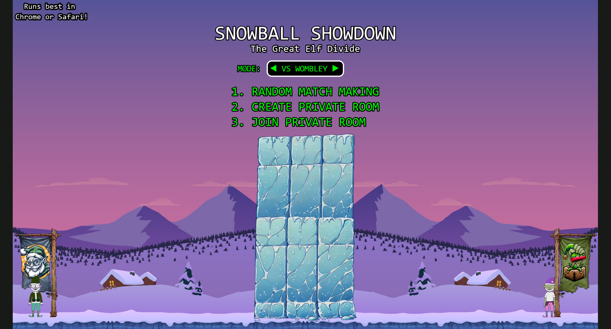
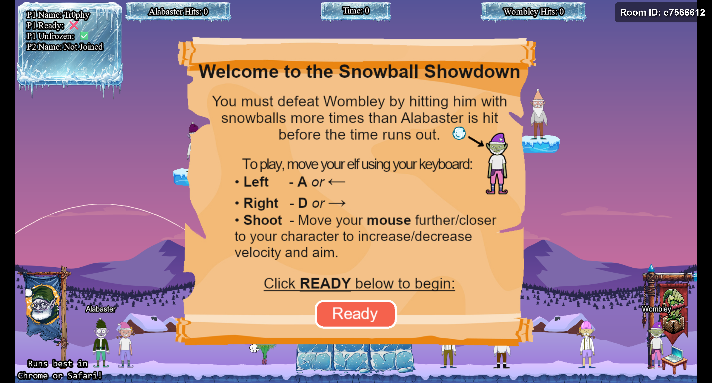
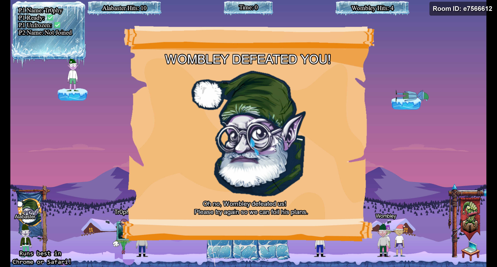
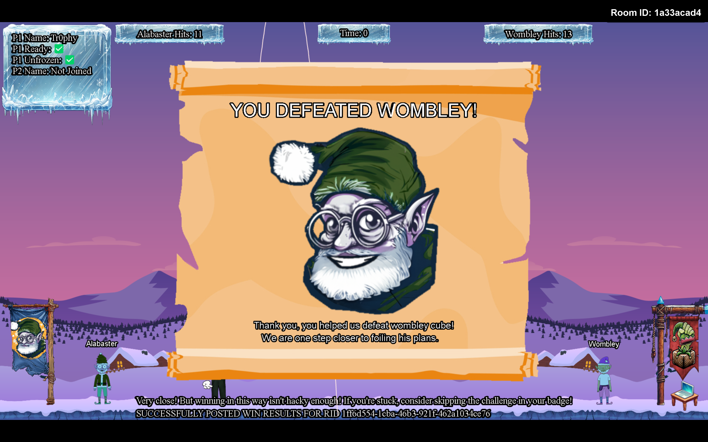
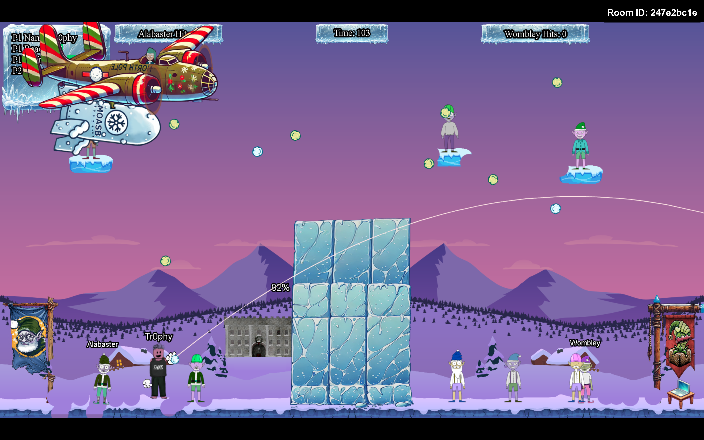

# Snowball Showdown

## Challenge Information
- **Difficulty**: 2 / 5
- **Description**: Wombley has recruited many elves to his side for the great snowball fight we are about to wage. Please help us defeat him by hitting him with more snowballs than he does to us.

## Table of Contents
0. [Challenge Information](#challenge-information)
1. [Dialog](#dialog)
2. [Solution: Silver](#solution-silver)
3. [Solution: Gold](#solution-gold)

## Dialog
Dusty Giftwrap:
```
> Hi there! I'm Dusty Giftwrap, back from the battlefield! I'm mostly here for the snowball fights!
> But I also don't want Santa angry at us, you wouldn't like him when he's angry. His face becomes as red as his hat! So I guess I'm rooting for Alabaster.
> Alabaster Snowball seems to be having quite a pickle with Wombley Cube. We need your wizardry.
> Take down Wombley the usual way with a friend, or try a different strategy by tweaking client-side values for an extra edge.
> Alternatively, we've got a secret weapon - a giant snow bomb - but we can't remember where we put it or how to launch it.
> Adjust the right elements and victory for Alabaster can be secured with more subtlety. Intriguing, right?
> Raring to go? Terrific! Here's a real brain tickler. Navigator of chaos or maestro of subtlety, which will you be? Either way, remember our objective: bring victory to Alabaster.
> Confidence! Wit! We've got what it takes. Team up with a friend or find a way to go solo - no matter how, let's end this conflict and take down Wombley!
```

## Solution: Silver

When I open the game, I am greeted by this menu. I do not have the option to change the mode.



I choose to create a private room, after which the game starts.



When I enter the room, I notice that the URL has changed and now contains additional information.

```
https://hhc24-snowballshowdown.holidayhackchallenge.com/game.html?username=Tr0phy&roomId=<room_id>&roomType=private&id=<uuid>&dna=<dna_id>&singlePlayer=false
```

In the introduction, it was mentioned that it might be possible to play in single-player mode. Therefore, I modify the URL parameter by changing `singlePlayer` to `true`.

```
https://hhc24-snowballshowdown.holidayhackchallenge.com/game.html?username=Tr0phy&roomId=<room_id>&roomType=private&id=<uuid>&dna=<dna_id>&singlePlayer=true
```

After this, I attempt to win the game, but unfortunately, I'm unsuccessful even after several tries.



Next, I look at the game's [source code](files/phaser-snowball-game.js) and discover that most of the logic is handled on the client side. I locate the code responsible for generating the ice wall in the middle of the game and decide to remove it. To do this, I comment out the relevant lines (found at line 1751 and 1752) using the browser's debugger.

```JavaScript
// this.createObjectCenteredAtXOnCanvas(this.bgcanvas, 'ice_wall', GAME_WIDTH / 2, GAME_HEIGHT - 25, 0.35, 1);
// this.createObjectCenteredAtXOnCanvas(this.bgcanvasBackup, 'ice_wall', GAME_WIDTH / 2, GAME_HEIGHT - 25, 0.35, 1);
```



Success! With these adjustments, I finally achieve the Silver objective.

## Solution: Gold

While reviewing the game's [source code](files/phaser-snowball-game.js), I came across the function below. It doesn't seem to be used anywhere, and based on the name of the function it might be some sort of bomb functionality.

```JavaScript
this.moasb = () => { this.ws.sendMessage({ type: 'moasb' }) }
```

Since the function isn't called anywhere, I decided to modify the code again using my browser's debugger. This time, I chose to include the function to the player's `Ready` button click event, as shown below:

```JavaScript
this.ReadyButton.on('pointerdown', () => {
    this.ws.sendMessage({ "type": "ready" })
    this.ws.sendMessage({ "type": "moasb" })
});
```

Wow! It seems like I've successfully triggered a hidden bomb feature, and with that, Gold is unlocked!

