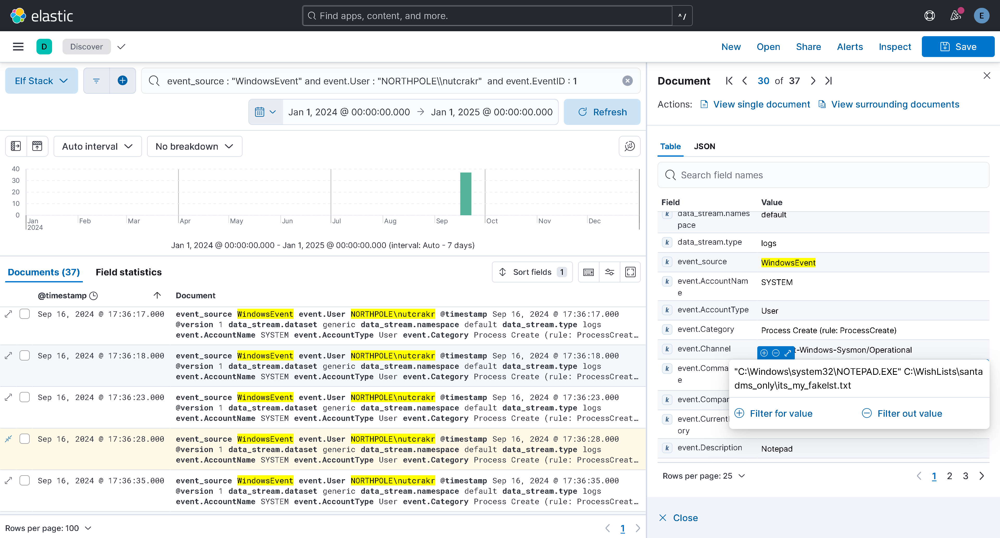

# Elf Stack

## Challenge Information
- **Difficulty**: 5 / 5
- **Description**: Help the ElfSOC analysts track down a malicious attack against the North Pole domain.

## Table of Contents
0. [Challenge Information](#challenge-information)
1. [Files](#files)
2. [Dialog](#dialog)
3. [Solution: Silver](#solution-silver)
4. [Solution: Gold](#solution-gold)

## Files
- [log_chunk_1.log.zip](files/log_chunk_1.log.zip)
- [log_chunk_2.log.zip](files/log_chunk_2.log.zip)
- [elf-stack-siem-with-logs.zip](files/elf-stack-siem-with-logs.zip)

## Dialog
Fitzy Shortstack:
```
> Greetings! I'm the genius behind the North Pole Elf Stack SIEM. And oh boy, we’ve got a situation on our hands.
> Our system was attacked—Wombley’s faction unleashed their FrostBit ransomware, and it’s caused a digital disaster.
> The logs are a mess, and Wombley’s laptop—the only backup of the Naughty-Nice List—was smashed to pieces.
> Now, it’s all up to you to help me trace the attack vectors and events. We need to figure out how this went down before it’s too late.
> You’ll be using a containerized ELK stack or Linux CLI tools. Sounds like a fun little puzzle, doesn't it?
> Your job is to analyze these logs... think of it as tracking snow tracks but in a digital blizzard.
> If you can find the attack path, maybe we can salvage what’s left and get Santa’s approval.
> Santa’s furious at the faction fighting, and he’s disappointed. We have to make things right.
> So, let’s show these attackers that the North Pole’s defenses are no joke!
```

## Solution: Silver

To achieve Silver, I needed to complete all the easy tasks.

### Question 1

**Question**: How many unique values are there for the event_source field in all logs?

To solve this, I used Elastic's capabilities to aggregate the data and count the unique values for the `event_source` field.


Answer: `5`

### Question 2

**Question**: Which event_source has the fewest number of events related to it?

To solve this, I used the table from the previous question, and looked at the bottom of the list.

Answer: `AuthLog`

### Question 3

**Question**: Using the event_source from the previous question as a filter, what is the field name that contains the name of the system the log event originated from?

To begin, I searched through all logs where the `event_source` field was set to `AuthLog`. This allowed me to filter the relevant entries and focus specifically on logs from this source.

After retrieving these logs, I carefully reviewed the available data fields in each log entry to identify the information they contained.


Answer: `event.hostname`

### Question 4

**Question**: Which event_source has the second highest number of events related to it?

To solve this, I used the table from [question 2](#question-2).

Answer: `NetflowPmacct`

### Question 5

**Question**: Using the event_source from the previous question as a filter, what is the name of the field that defines the destination port of the Netflow logs?

To begin, I searched through all logs where the `event_source` field was set to `NetflowPmacct`. This allowed me to filter the relevant entries and focus specifically on logs from this source.

After retrieving these logs, I carefully reviewed the available data fields to identify the information they contained.


Answer: `event.port_dst`

### Question 6

**Question**: Which event_source is related to email traffic?

To solve this task, I referred to the table from [question 2](#question-2). By analyzing the naming conventions in the table, I was able to identify the correct answer.

Answer: `SnowGlowMailPxy`

### Question 7

**Question**: Looking at the event source from the last question, what is the name of the field that contains the actual email text?

To begin, I searched through all logs where the `event_source` field was set to `SnowGlowMailPxy`. This allowed me to filter the relevant entries and focus specifically on logs from this source.

After retrieving these logs, I carefully reviewed the available data fields to identify the information they contained.


Answer: `event.Body`

### Question 8

**Question**: Using the ‘GreenCoat’ event_source, what is the only value in the hostname field?


Answer: `SecureElfGwy`

### Question 9

**Question**: Using the ‘GreenCoat’ event_source, what is the name of the field that contains the site visited by a client in the network?

To begin, I searched through all logs where the `event_source` field was set to `GreenCoat`. This allowed me to filter the relevant entries and focus specifically on logs from this source.

After retrieving these logs, I reviewed the available data fields to identify the information they contained.


Answer: `event.url`

### Question 10

**Question**: Using the ‘GreenCoat’ event_source, which unique URL and port (URL:port) did clients in the TinselStream network visit most?

To begin, I searched through all logs where the `event_source` field was set to `GreenCoat`. This allowed me to filter the relevant entries and focus specifically on logs from this source.

After retrieving these logs, I reviewed the top values for the `event.url` data field.


Answer: `pagead2.googlesyndication.com:443`

### Question 11

**Question**: Using the ‘WindowsEvent’ event_source, how many unique Channels is the SIEM receiving Windows event logs from?

To begin, I searched through all logs where the `event_source` field was set to `WindowsEvent`. This allowed me to filter the relevant entries and focus specifically on logs from this source.

After retrieving these logs, I reviewed the top values for the `event.Channel` data field.


Answer: `5`

### Question 12

**Question**: What is the name of the event.Channel (or Channel) with the second highest number of events?

To solve this, I used the table from the previous question.

Answer: `Microsoft-Windows-Sysmon/Operational`

### Question 13

**Question**: Our environment is using Sysmon to track many different events on Windows systems. What is the Sysmon Event ID related to loading of a driver?

I used the [Sysmon documentation](https://learn.microsoft.com/en-us/sysinternals/downloads/sysmon) to identify the correct Event ID.

Answer: `6`

### Question 14

**Question**: What is the Windows event ID that is recorded when a new service is installed on a system?

I used a list over [Windows Security Log Events](https://www.ultimatewindowssecurity.com/securitylog/encyclopedia/) to identify the correct Event ID.

Answer: `4697`

### Question 15

**Question**: Using the WindowsEvent event_source as your initial filter, how many user accounts were created?

To solve this task, I focused on identifying events where user accounts were created. Event ID [4720](https://learn.microsoft.com/en-us/previous-versions/windows/it-pro/windows-10/security/threat-protection/auditing/event-4720) corresponds to this action.

Despite filtering for this event type, the logs did not show any records of user accounts being created.


Answer: `0`

## Solution: Gold

To achieve Gold, I needed to complete all the hard tasks.

### Question 1

**Question**: What is the event.EventID number for Sysmon event logs relating to process creation?

I used the Sysmon documentation from [question 13](#question-13) to identify the correct Event ID.

Answer: `1`

### Question 2

**Question**: How many unique values are there for the ’event_source’ field in all of the logs?

This is the same question as [question 1](#question-1).

Answer: `5`

### Question 3

**Question**: What is the event_source name that contains the email logs?

This is the same question as [question 6](#question-6).

Answer: `SnowGlowMailPxy`

### Question 4

**Question**: The North Pole network was compromised recently through a sophisticated phishing attack sent to one of our elves. The attacker found a way to bypass the middleware that prevented phishing emails from getting to North Pole elves. As a result, one of the Received IPs will likely be different from what most email logs contain. Find the email log in question and submit the value in the event ‘From:’ field for this email log event.

 I analyzed the email logs to gather key information about the IP addresses and senders. By carefully reviewing the logs, I identified the fields that contained this information and extracted the relevant data. To better visualize the relationships between the IP addresses and their associated senders, I organized the data into a clear table.


Answer: `kriskring1e@northpole.local`

### Question 5

**Question**: Our ElfSOC analysts need your help identifying the hostname of the domain computer that established a connection to the attacker after receiving the phishing email from the previous question. You can take a look at our GreenCoat proxy logs as an event source. Since it is a domain computer, we only need the hostname, not the fully qualified domain name (FQDN) of the system.

Based on the answer from the previous question, I was able to locate the affected user.


After the affected user as located, I used the proxy logs to identify the host.


Answer: `SleighRider`

### Question 6

**Question**: What was the IP address of the system you found in the previous question?

I used the logs from the previous question, and checked the field for the IP address.


Answer: `172.24.25.12`

### Question 7

**Question**: A process was launched when the user executed the program AFTER they downloaded it. What was that Process ID number (digits only please)?

Based on the provided information, I constructed the following query. This query specifically searches for Windows event logs that include the affected user, the host, and the relevant event ID.

```KQL
event_source : "WindowsEvent" and event.EventID : "1" and event.Hostname : "SleighRider.northpole.local" and (event.CommandLine : *elf_user02* or event.ParentCommandLine : *elf_user02*)
```


Answer: `10014`

### Question 8

**Question**: Did the attacker’s payload make an outbound network connection? Our ElfSOC analysts need your help identifying the destination TCP port of this connection.

Based on the logs from the previous question, I constructed the following query. This query specifically searches for Windows event logs that include the relevant event ID and the attacker's payload.

After the connection was identified, I found the destination port.

```KQL
event_source : "WindowsEvent" and event.EventID : "3" and event.Image : "C:\Users\elf_user02\Downloads\howtosavexmas\howtosavexmas.pdf.exe"
```


Answer: `8443`

### Question 9

**Question**: The attacker escalated their privileges to the SYSTEM account by creating an inter-process communication (IPC) channel. Submit the alpha-numeric name for the IPC channel used by the attacker.

IPC means Pipes. I made a lucky guess with the query below.

```KQL
event_source : "WindowsEvent" and event.EventID : "1" and *pipe*
```


Answer: `ddpvccdbr`

### Question 10

**Question**: The attacker’s process attempted to access a file. Submit the full and complete file path accessed by the attacker’s process.

Based on the information provided, and the answers from the previous questions, I constructed the query below. This query specifically searches for Windows event logs that include the relevant event id for then file or folder is accessed, modified, or deleted and the process id for the attackers process.

```KQL
event_source : "WindowsEvent" and event.ProcessID : 10014 and event.EventID : 4663
```


Answer: `C:\Users\elf_user02\Desktop\kkringl315@10.12.25.24.pem`

### Question 11

**Question**: The attacker attempted to use a secure protocol to connect to a remote system. What is the hostname of the target server?

I began by constructing a query to locate all authentication logs (`AuthLog`) that included a hostname. After running the query, I analyzed the output to determine how many unique hostnames were present in the logs. Surprisingly, the results revealed that there was only one hostname across all the entries.

```KQL
event_source : "AuthLog" and event.hostname : * 
```


Answer: `kringleSSleigH`

### Question 12

**Question**: The attacker created an account to establish their persistence on the Linux host. What is the name of the new account created by the attacker?

Based on the provided information, I constructed the following query. This query is designed to search for logs containing the keyword `adduser`, which is the Linux command used to create a new user.

```KQL
event_source : "AuthLog" and event.message : *adduser*
```


Answer: `ssdh`

### Question 13

**Question**: The attacker wanted to maintain persistence on the Linux host they gained access to and executed multiple binaries to achieve their goal. What was the full CLI syntax of the binary the attacker executed after they created the new user account?

Based on the answer from the previous question, I proceeded by searching for auth logs that contained the username. After filtering the logs, I manually reviewed the 11 relevant entries to find the syntax.

```KQL
event_source : "AuthLog" and event.message : *ssdh*
```


Answer: `/usr/sbin/usermod -a -G sudo ssdh`

### Question 14

**Question**: The attacker enumerated Active Directory using a well known tool to map our Active Directory domain over LDAP. Submit the full ISO8601 compliant timestamp when the first request of the data collection attack sequence was initially recorded against the domain controller.

Based on the information provided, I first constructed a query to search for the LDAP port within the auth logs. After retrieving the initial results, I filtered them by the date (Old-New) to narrow down the entries. Finally, I examined the first log entry in the filtered results and extracted the necessary information.

```KQL
event_source: "WindowsEvent" and event.ServicePort : 389
```


Answer: `2024-09-16T11:10:12-04:00`

### Question 15

**Question**: The attacker attempted to perform an ADCS ESC1 attack, but certificate services denied their certificate request. Submit the name of the software responsible for preventing this initial attack.

Based on the information provided, I constructed a query to search for Windows event logs that included a relevant event ID. The query returned a single log entry. Within that entry, I was able to locate the name of the software.

```KQL
event_source: "WindowsEvent" and (event.EventID : 4888 or event.EventID : 4889 or event.EventID : 4890)
```


Answer: `KringleGuard`

### Question 16

**Question**: We think the attacker successfully performed an ADCS ESC1 attack. Can you find the name of the user they successfully requested a certificate on behalf of?

Based on the information provided, I constructed a query to search for Windows event logs that included the relevant event ID.

```KQL
event_source: "WindowsEvent" and event.EventID : 4886
```


Answer: `nutcrakr`

### Question 17

**Question**: One of our file shares was accessed by the attacker using the elevated user account (from the ADCS attack). Submit the folder name of the share they accessed.

Based on the information provided, I constructed a query to search for Windows event logs that included the relevant event ID and the accountname from the last questiong.

```KQL
event_source: "WindowsEvent" and event.EventID : 5145 and event.Subject_AccountName : "nutcrakr" 
```


Answer: `WishLists`

### Question 18

**Question**: The naughty attacker continued to use their privileged account to execute a PowerShell script to gain domain administrative privileges. What is the password for the account the attacker used in their attack payload?

This task took me quite a while to complete. After spending several hours trying to find the answer using Elastic, I wasn't able to locate it. So, I decided to switch strategies and use `grep` on the files instead. Based on the information provided, I suspected I was looking for PowerShell activity. With this in mind, I used `scriptblocktext` and the account name from the previous question as my search criteria. By grepping for these terms, I was able to locate the relevant information in the files.

```bash
grep -i scriptblocktext *.log | grep -i nutcrakr
```

```
log_chunk_2.log:<134>1 2024-09-16T11:33:12-04:00 SleighRider.northpole.local WindowsEvent - - - {"MessageNumber": 1, "MessageTotal": 1, "ScriptBlockText": "Add-Type -AssemblyName System.DirectoryServices\n$ldapConnString = \"LDAP://CN=Domain Admins,CN=Users,DC=northpole,DC=local\"\n$username = \"nutcrakr\"\n$pswd = 'fR0s3nF1@k3_s'\n$nullGUID = [guid]'00000000-0000-0000-0000-000000000000'\n$propGUID = [guid]'00000000-0000-0000-0000-000000000000'\n$IdentityReference = (New-Object System.Security.Principal.NTAccount(\"northpole.local\\$username\")).Translate([System.Security.Principal.SecurityIdentifier])\n$inheritanceType = [System.DirectoryServices.ActiveDirectorySecurityInheritance]::None\n$ACE = New-Object System.DirectoryServices.ActiveDirectoryAccessRule $IdentityReference, ([System.DirectoryServices.ActiveDirectoryRights] \"GenericAll\"), ([System.Security.AccessControl.AccessControlType] \"Allow\"), $propGUID, $inheritanceType, $nullGUID\n$domainDirEntry = New-Object System.DirectoryServices.DirectoryEntry $ldapConnString, $username, $pswd\n$secOptions = $domainDirEntry.get_Options()\n$secOptions.SecurityMasks = [System.DirectoryServices.SecurityMasks]::Dacl\n$domainDirEntry.RefreshCache()\n$domainDirEntry.get_ObjectSecurity().AddAccessRule($ACE)\n$domainDirEntry.CommitChanges()\n$domainDirEntry.dispose()\n$ldapConnString = \"LDAP://CN=Domain Admins,CN=Users,DC=northpole,DC=local\"\n$domainDirEntry = New-Object System.DirectoryServices.DirectoryEntry $ldapConnString, $username, $pswd\n$user = New-Object System.Security.Principal.NTAccount(\"northpole.local\\$username\")\n$sid=$user.Translate([System.Security.Principal.SecurityIdentifier])\n$b=New-Object byte[] $sid.BinaryLength\n$sid.GetBinaryForm($b,0)\n$hexSID=[BitConverter]::ToString($b).Replace('-','')\n$domainDirEntry.Add(\"LDAP://<SID=$hexSID>\")\n$domainDirEntry.CommitChanges()\n$domainDirEntry.dispose()", "ScriptBlockId": "{01bbe2da-58c3-4490-aa52-682dbae233a3}", "Path": "", "Provider_Name": "Microsoft-Windows-PowerShell", "Provider_Guid": "{a0c1853b-5c40-4b15-8766-3cf1c58f985a}", "EventID": 4104, "Version": 1, "Level": 5, "Task": 2, "Opcode": 15, "Keywords": "0x0", "TimeCreated_SystemTime": "2024-09-16T11:33:12-04:00", "EventRecordID": 54059, "Correlation_ActivityID": "{17aa0df9-5d3d-46e9-bce0-55b7a5be4b43}", "ParentProcessID": 928, "ThreadID": 4896, "Channel": "Microsoft-Windows-PowerShell/Operational", "Computer": "SleighRider.northpole.local", "Security_UserID": "S-1-5-21-3699322559-1991583901-1175093138-1110"}
```

Answer: `fR0s3nF1@k3_s`

### Question 19

**Question**: The attacker then used remote desktop to remotely access one of our domain computers. What is the full ISO8601 compliant UTC EventTime when they established this connection?

Based on the provided information, I constructed a query to search for Windows event logs that match the relevant event ID and the known account name.

```KQL
event_source : "WindowsEvent" and event.NewLogon_AccountName : "nutcrakr" and event.LogonType : 10
```


Answe: `2024-09-16T15:35:57.000Z`

### Question 20

**Question**: The attacker is trying to create their own naughty and nice list! What is the full file path they created using their remote desktop connection?

I constructed a query to search for Windows event logs that match the relevant event ID and the known account name.
The query resulted in 37 logs, and I looked through them to find the full file path.

```KQL
event_source : "WindowsEvent" and event.User : "NORTHPOLE\\nutcrakr"  and event.EventID : 1
```



Answer: `C:\WishLists\santadms_only\its_my_fakelst.txt`

### Question 21

**Question**: The Wombley faction has user accounts in our environment. How many unique Wombley faction users sent an email message within the domain?

At first, I wasn't entirely sure how to approach this task. To begin, I decided to focus on the email logs and look for entries where the recipient's email address ended with `@northpole.local`. Using Elastic, I applied a filter to isolate these logs and narrow down the data.

To analyze the results, I utilized Elastic's visualization tool, which helped me identify and group the different email accounts associated with the domain. Luckily, there weren't too many valid accounts to sift through, which made the task more manageable.

```KQL
event_source : "SnowGlowMailPxy" and event.To : *@northpole.local
```


Answer: `4`

### Question 22

**Question**: The Alabaster faction also has some user accounts in our environment. How many emails were sent by the Alabaster users to the Wombley faction users?

Using the insights from the previous task and the information provided, I built the following query to proceed with the analysis.

```KQL
event_source : "SnowGlowMailPxy" and event.From : asnowball* and event.To : wcub*
```


Answer: `22`

### Question 23

**Question**: Of all the reindeer, there are only nine. What’s the full domain for the one whose nose does glow and shine? To help you narrow your search, search the events in the 'SnowGlowMailPxy' event source.

To solve this task, I searched the logs for entries containing the keywords `glow` or `shine` and carefully reviewed the results to identify the domain.

```KQL
event_source : "SnowGlowMailPxy" and (*glow* or *shine*)
```


Answer: `rud01ph.glow`

### Question 24

**Question**: With a fiery tail seen once in great years, what’s the domain for the reindeer who flies without fears? To help you narrow your search, search the events in the ‘SnowGlowMailPxy’ event source.

The qustion starts of with an important clue, `With a fiery tail seen once in great years`. This could only mean Halleys comet, which I will use as my query.

```KQL
event_source : "SnowGlowMailPxy" and *halley*
```


Answer: `c0m3t.halleys`