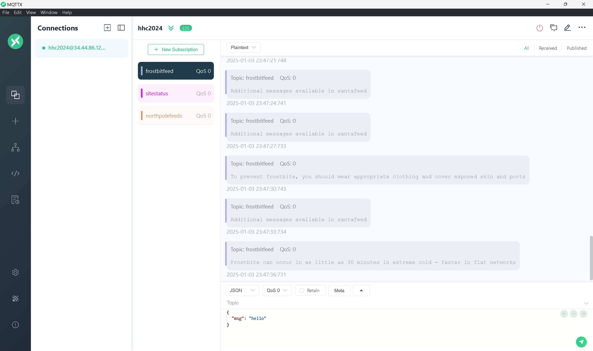

# Santa Vision

## Challenge Information
- **Difficulty**: 4 / 5
- **Description**: Alabaster and Wombley have poisoned the Santa Vision feeds! Knock them out to restore everyone back to their regularly scheduled programming.

## Table of Contents
0. [Challenge Information](#challenge-information)
1. [Dialog](#dialog)
2. [Santa Vision A](#santa-vision-a)
    - [Subchallenge Information](#subchallenge-information)
    - [Solution: Silver](#solution-silver)
    - [Solution: Gold](#solution-gold)
3. [Santa Vision B](#santa-vision-b)
    - [Subchallenge Information](#subchallenge-information-1)
    - [Solution: Silver](#solution-silver-1)
    - [Solution: Gold](#solution-gold-1)
4. [Santa Vision C](#santa-vision-c)
    - [Subchallenge Information](#subchallenge-information-2)
    - [Solution: Silver](#solution-silver-2)
    - [Solution: Gold](#solution-gold-2)
5. [Santa Vision D](#santa-vision-d)
    - [Subchallenge Information](#subchallenge-information-3)
    - [Solution: Silver](#solution-silver-3)
    - [Solution: Gold](#solution-gold-3)

## Dialog
Ribb Bonbowford:
```
> Hi, Ribb Bonbowford here, ready to guide you through the SantaVision dilemma!
> The Santa Broadcast Network (SBN) has been hijacked by Wombley's goons—they're using it to spread propaganda and recruit elves! And Alabaster joined in out of necessity. Quite the predicament, isn’t it?
> To access this challenge, use this terminal to access your own instance of the SantaVision infrastructure.
> Once it's done baking, you'll see an IP address that you'll need to scan for listening services.
> Our target is the technology behind the SBN. We need make a key change to its configuration.
> We’ve got to remove their ability to use their admin privileges. This is a delicate maneuver—are you ready?
> We need to change the application so that multiple administrators are not permitted. A misstep could cause major issues, so precision is key.
> Once that’s done, positive, cooperative images will return to the broadcast. The holiday spirit must prevail!
> This means connecting to the network and pinpointing the right accounts. Don’t worry, we'll get through this.
> Let’s ensure the broadcast promotes unity among the elves. They deserve to see the season’s spirit, don't you think?
> Remember, it’s about cooperation and togetherness. Let's restore that and bring back the holiday cheer. Best of luck!
> The first step to unraveling this mess is gaining access to the SantaVision portal. You'll need the right credentials to slip through the front door—what username will get you in?
```

## Santa Vision A

## Subchallenge Information
- **Difficulty**: 2 / 5
- **Description**: What username logs you into the SantaVision portal?

## Solution: Silver

I began by performing a full port scan on the target using nmap:

```bash
nmap -sS <target_ip> -p-
```
Explanation of Flags
- `-sS`: Performs a TCP SYN scan, which is fast and stealthy. It sends SYN packets to determine open ports without completing the TCP handshake.
- `-p-`: Instructs Nmap to scan all 65,535 ports (rather than just the most common ones).

The scan revealed the following open and filtered ports:

|Port|State|Service|
|-|-|-|
|22/tcp|open|ssh|
|25/tcp|filtered|smtp|
|1883/tcp|open|mqtt|
|5355/tcp|filtered|llmnr|
|8000/tcp|open|http-alt|
|9001/tcp|open|tor-orport|
|18290/tcp|filtered|unknown|
|48328/tcp|filtered|unknown|

I decided to investigate the web service hosted on port `8000/tcp`.
Upon visiting the page, I noticed that it primarily consisted of a login form:


Suspecting there might be hidden clues, I inspected the page source code for comments or embedded information.

While examining the HTML source, I found a comment containing what appeared to be MQTT credentials:

```HTML
<!-- mqtt: elfanon:elfanon -->
```

I tested the discovered credentials `elfanon:elfanon` on the login page, and they worked.

Answer: `elfanon`

## Solution: Gold

While inspecting the website, I noticed that under the copyright text, there was a mention of topic `sitestatus` been available. I decided to explore this further using MQTTX.

I connected to the relevant feed using MQTTX, as I had done in a previous task, and monitored the messages for any useful information.

After some time, I received the following message containing a link to a file.

I proceeded to access the file via the provided link.


```
File downloaded: /static/sv-application-2024-SuperTopSecret-9265193/applicationDefault.bin
```

To gather more information about the file, I ran the `file` command.

```bash
file applicationDefault.bin
```

The command provided the following details.

```
applicationDefault.bin: Linux jffs2 filesystem data little endian
```

I chose to decompile the file using `Jefferson`. After decompiling, I reviewed the contents and discovered the download link for the file applicationDefault.bin, along with a reference to an SQLite file located in the file at `app/src/accounts/views.py`

```Python
@accounts_bp.route("/static/sv-application-2024-SuperTopSecret-9265193/applicationDefault.bin", methods=["GET"])
def firmware():
    return send_from_directory("static", "sv-application-2024-SuperTopSecret-9265193/applicationDefault.bin", as_attachment=True)
    
@accounts_bp.route("/sv2024DB-Santa/SantasTopSecretDB-2024-Z.sqlite", methods=["GET"])
def db():
    return send_from_directory("static", "sv2024DB-Santa/SantasTopSecretDB-2024-Z.sqlite", as_attachment=True)
```

I followed the link to download the SQLite file from the URL:
```
http://<target_ip>:8000/sv2024DB-Santa/SantasTopSecretDB-2024-Z.sqlite
```

Once downloaded, I opened the SQLite file and navigated to the users table. There, I found the following row:

|id|username|password|created_on|is_admin|
|-|-|-|-|-|
|1|santaSiteAdmin|S4n+4sr3411yC00Lp455wd|2024-01-23 06:05:29.466071|1|

I attempted to log in to the website using the extracted credentials `santaSiteAdmin:S4n+4sr3411yC00Lp455wd`, and the login was successful, confirming that the credentials were valid.

Answer: `santaSiteAdmin`

## Santa Vision B

## Subchallenge Information
- **Difficulty**: 3 / 5
- **Description**: Once logged on, authenticate further without using Wombley's or Alabaster's accounts to see the `northpolefeeds` on the monitors. What username worked here?

## Solution: Silver

Using the discovered credentials `elfanon:elfanon`, I successfully logged in and was greeted with the following dashboard:


Clicking the `List Available Clients` button displayed the following:
```
Available clients: 'elfmonitor', 'WomblyC', 'AlabasterS'
```

Clicking the `List Available Roles` button displayed the following:
```
Available roles: 'SiteDefaultPasswordRole', 'SiteElfMonitorRole', 'SiteAlabsterSAdminRole', 'SiteWomblyCAdminRole'
```

Using the options from the dashboard, I attempted to power on the monitors. After trying various combinations of roles and clients, I successfully authenticated with the following combination:

```
elfmonitor:SiteElfMonitorRole
```


Answer: `elfmonitor`

## Solution: Gold

While inspecting the HTTP headers for the monitoring GUI, I accessed the following URL: `http://<target_ip>:8000/auth?id=viewer&loginName=santaSiteAdmin`

In the response headers, I found additional credentials hidden.

```
BrkrTopic: northpolefeeds
BrkrUser: santashelper2024
BrkrPswd: playerSantaHelperPass2860403103
```

With this new information, I tried powering on the monitors and connecting to the feed. Using the credentials found in the headers, I was able to establish a connection successfully.


Answer: `santashelper2024`

## Santa Vision C

## Subchallenge Information
- **Difficulty**: 4 / 5
- **Description**: Using the information available to you in the SantaVision platform, subscribe to the `frostbitfeed` MQTT topic. Are there any other feeds available? What is the code name for the elves' secret operation?

## Solution: Silver

Since the web application lacked direct functionality to interact with MQTT feeds, I downloaded and installed [MQTTX](https://mqttx.app/), a cross-platform MQTT client.

Using the credentials from the earlier steps `elfmonitor:SiteElfMonitorRole`, I connected to the MQTT service.



After exploring various feeds, I discovered one named `santafeed`. Connecting to this feed revealed a codename: `Idemcerybu`


Answer: `Idemcerybu`

## Solution: Gold

I revisited the codename `Idemcerybu` that we discovered during the Silver task. It was encoded using ROT11, so I decided to decode it.

I used the online tool at [dcode.fr](https://www.dcode.fr/rot-cipher) to decode the string with ROT11.

After decoding, I revealed the codename: `snowmobile`

Answer: `snowmobile`

## Santa Vision D

## Subchallenge Information
- **Difficulty**: 4 / 5
- **Description**: There are too many admins. Demote Wombley and Alabaster with a single MQTT message to correct the `northpolefeeds` feed. What type of contraption do you see Santa on?

## Solution: Silver

While exploring the MQTT service, I identified three feeds of interest:
- `frostbitfeed`
- `northpolefeeds`
- `santafeed`

Among these, `santafeed` contained the most relevant data.

By piecing together hints from both the web GUI and MQTT messages, I deduced the required message format to send to the `santafeed`. The format was as follows:

`singleAdminMode=true&role=SiteElfMonitorRole&user=elfanon`

Using the web dashboard, I sent this plaintext message to the santafeed.
After sending the message, the monitors displayed images of Santa on a pogo stick:


Answer: `pogo stick`

## Solution: Gold
To solve this task, I needed to send the same message as in the silver task, but this time using the MQTTX client instead of the website.

The message I sent was as follows:
```
singleAdminMode=true&role=SiteElfMonitorRole&user=elfanon
```

After sending the message, I observed the monitors, and this time, they displayed images of Santa using a hovercraft.


Answer: `hovercraft`