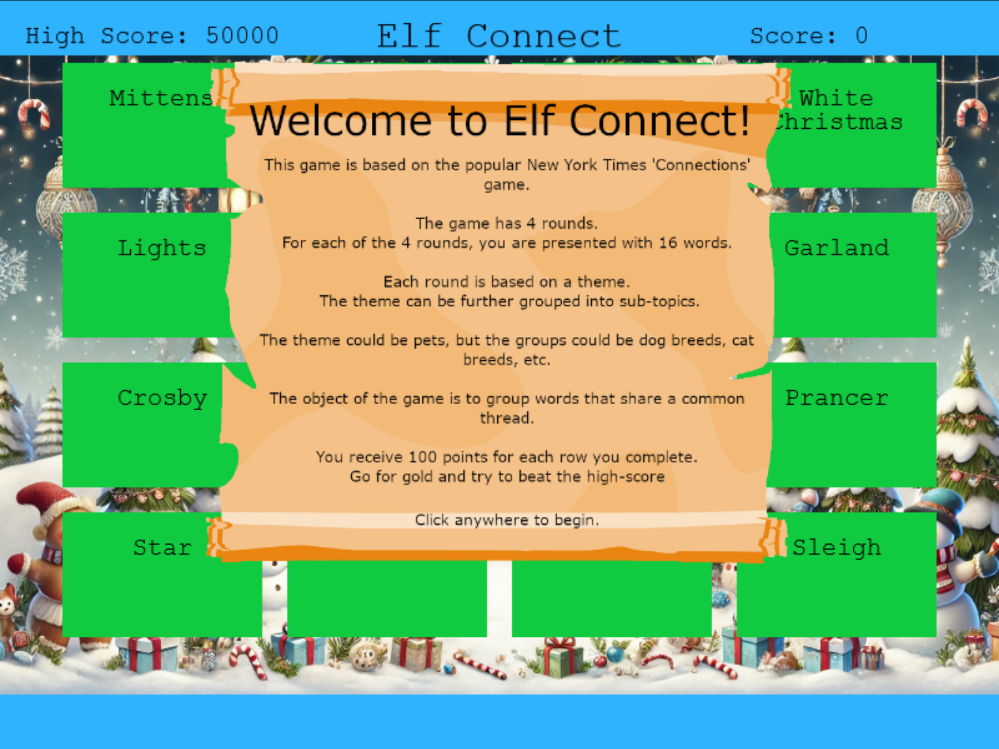

# Elf Connect

## Challenge Information
- **Difficulty**: 1 / 5
- **Description**: Help Angel Candysalt connect the dots in a game of connections.

## Table of Contents
0. [Challenge Information](#challenge-information)
1. [Dialog](#dialog)
2. [Solution: Silver](#solution-silver)
3. [Solution: Gold](#solution-gold)

## Dialog
Angel Candysalt:
```
> Welcome back, island adventurer! I'm Angel Candysalt — so happy to finally meet you!
> I'm thrilled you're here because I could really use a hand with something.
> Have you ever heard of a game called Connections?
> It’s simple! All you need to do is find groups of four related words.
> I've been stuck on it all day, and I'm sure someone as sharp as you will breeze through it.
> Oh, and while you're at it, check out randomElf's score — they hit fifty thousand points, which seems… oddly suspicious.
> Think they might have tampered with the game? Just a hunch!
```

## Solution: Silver
When we open the challenge, we are greeted with an introduction to the game and its rules. This information can be seen in the image below.



The game seems quite simple. The task is to match the four words that go together. Below is a list of which words match at each round, along with a brief description of why they belong together.

### Round 1
- Group 1
    - **Words**: Comet, Vixen, Prancer, Blitzen
    - **Description**: All names of reindeer in the famous Christmas song "Rudolph the Red-Nosed Reindeer." They are part of Santa Claus's reindeer team that helps pull his sleigh on Christmas Eve.

- Group 2
    - **Words**: Belafonte, Jingle Bells, Crosby, White Christmas
    - **Description**: Associated with iconic Christmas music

- Group 3
    - **Words**: Tinsel, Garland, Star, Lights
    - **Description**: Common decorative elements used during the holiday season, particularly for Christmas decorations

- Group 4
    - **Words**: Bag, Sleigh, Mittens, Gifts
    - **Description**: These items are often linked to the festive spirit of giving, winter weather, and holiday traditions

### Round 2
- Group 1
    - **Words**: Metasploit, Cobalt Strike, HAVOC, Empire
    - **Description**: Penetration testing and red team tools

- Group 2
    - **Words**: Frida, Cycript, AppMon, apktool
    - **Description**: Tools commonly used in mobile application security testing and reverse engineering

- Group 3
    - **Words**: Nmap, netcat, Wireshark, Nessus
    - **Description**: Tools commonly used in network security

- Group 4
    - **Words**: OWASP Zap, wfuzz, Nikto, burp
    - **Description**: Open-source security tools commonly used for web application security testing

### Round 3
- Group 1
    - **Words**: Caesar, One-time Pad, Ottendorf, Scytale
    - **Description**: Types of classical encryption methods or ciphers used in cryptography

- Group 2
    - **Words**: WEP, WPA2, TKIP, LEAP
    - **Description**: All related to wireless network security protocols and encryption methods

- Group 3
    - **Words**: Symmetric, Asymmetric, hash, hybrid
    - **Description**: Cryptography and encryption techniques

- Group 4
    - **Words**: 3DES, RSA, AES, Blowfish
    - **Description**: Cryptographic algorithms

### Round 4
- Group 1
    - **Words**: TLS, SSL, IPSec, SSH
    - **Description**: Cryptographic protocols designed to secure communication over networks

- Group 2
    - **Words**: HTTP, FTP, SMTP, DNS
    - **Description**: Protocols used for communication across the internet

- Group 3
    - **Words**: IGMP, IPX, IP, ICMP
    - **Description**: Networking protocols used to facilitate communication in computer networks

- Group 4
    - **Words**: IEEE 802.11, Ethernet, ARP, PPP
    - **Description**: Methods and standards for how data is transmitted and managed across different types of networks

After completing these four rounds, we have unlocked the silver solution. However, we have only scored 1600 points, which is far from the 50,000 points needed to break the high score and earn the gold solution.

## Solution: Gold
In the [Solution: Silver](#solution-silver), we realized that simply completing the game is not enough. Therefore, we need to find another way to beat the high score, as this is what is required to unlock the gold solution.

Since the game is in the browser, I decide to inspect the game's source code on the client side to see if there is any way to manipulate the game.

In the source, I quickly find a lot of JavaScript and several variables, including all the words and how they should be paired. One of these variables is called "Score," which represents the player's current score.

Here is an excerpt from the JavaScript code, where you can see that the user's score is just a variable. The full JavaScript code can be found [here](files/game.js).

```Javascript
...
let successBackground;
let mainScene;
let score = parseInt(sessionStorage.getItem('score') || '0'); // Initialize score
let scoreText;  // Text object for score display
let highScore = 50000;
let highScoreText; // text object for high score
...
```

With this knowledge, I decide to start a new game. Before I begin, I access the console for the iframe element where the game is running and set my current score to 100,000 by typing `score = 100000`. I then match four words that go together (Comet, Vixen, Prancer, Blitzen), and as a result, I beat the high score.

After this, the challenge is registered as solved.